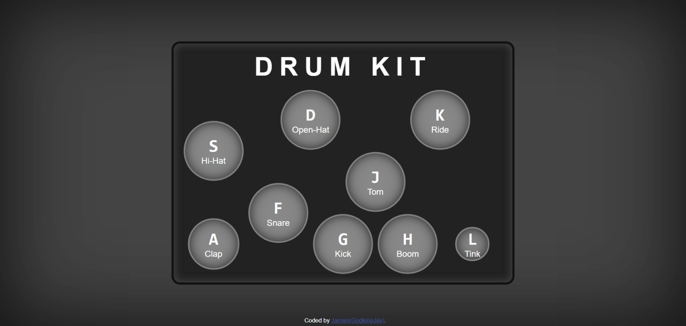

# JavaSrcipt30 (Build A JavaScript Drum Kit)

This is my code of the "Build A JavaScript Drum Kit" tutorial of JavaScript30.

## Table of contents

- [Overview](#overview)
  - [The challenge](#the-challenge)
  - [Screenshot](#screenshot)
  - [Links](#links)
- [My process](#my-process)
  - [Built with](#built-with)
- [Author](#author)

## Overview

### The challenge

Build an interactive Drum Kit:
- it should be able to play sounds when key is hit.

### Screenshot

### Links

- Live Site: ---> [LINK](https://godkingjay.github.io/JavaScript30-01-Drum-Kit/)

## My process

### Built with

- Semantic HTML5 markup
- CSS custom properties
- Javascript

## Author

- Twitter - [@godking_jay](https://www.twitter.com/godking_jay)
